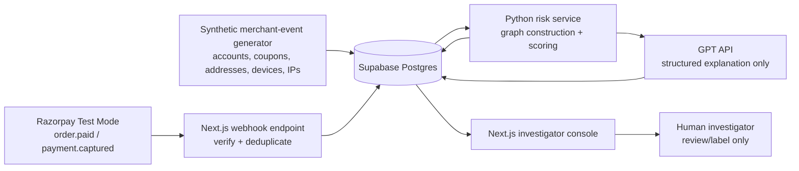
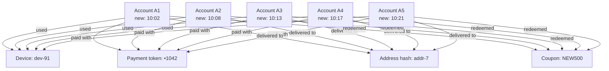

# Abuse-Ring Sentinel — Buildathon Plan

## 1. Submission goal

Build a **read-only, explainable risk-intelligence product** for detecting coordinated
new-customer promotion/coupon abuse.

The product discovers accounts that look independent in isolation but form a suspicious
ring when connected through shared payment and merchant-behaviour signals. It produces
evidence for a merchant investigator; it never changes the outcome of a payment or order.

**Buildathon track:** AI Risk Manager.

## 2. Scope and product boundary

### In scope

- Razorpay **Test Mode** order/payment event ingestion (webhook-shaped events, with an
  optional live test-mode webhook setup).
- A synthetic merchant checkout/event generator supplying account, coupon, address,
  device, IP, and referral metadata that payment events do not normally contain.
- A graph detector for coordinated first-order coupon abuse.
- Investigator UI: rings, linked entities, evidence, risk, estimated exposure, and review
  outcome.
- Deterministic held-out evaluation: precision, recall, F1, confusion matrix, and estimated
  false-positive review cost.
- GPT API-generated explanations from already-computed evidence only.

### Explicitly out of scope

- Shopify, Stripe, or other payment-provider integrations.
- Payment capture, cancellation, refund, coupon revocation, account blocking, or any other
  automatic adverse action.
- Making a fraud decision solely with an LLM.
- Using production customer personal data in the demo.

## 3. Success criteria

At the end, a reviewer can:

1. Replay a realistic batch of events or receive a new Razorpay Test Mode event.
2. See an investigator queue containing a suspicious ring.
3. Open the ring graph and inspect every linking edge and underlying event.
4. Understand why it was flagged, the potential merchant loss, and confidence/limitations.
5. See metrics calculated on a genuinely held-out set of rings.
6. Verify that the system only recommends **manual investigation**.

## 4. Architecture

### Technology choices

| Layer | Choice | Reason |
| --- | --- | --- |
| UI and integration API | Next.js + TypeScript | Single product surface, secure webhook endpoint, polished dashboard. |
| Database | Supabase Postgres | Fast auth/data setup, relational storage for events and cases. |
| Risk pipeline | Python + FastAPI | Strong data/ML tooling and clear separation from UI. |
| Graph analysis | NetworkX | Sufficient for synthetic buildathon data; transparent algorithms. |
| Graph visualization | Cytoscape.js | Interactive, inspectable entity relationship graph in the browser. |
| Explanation | OpenAI GPT API | Turns structured evidence into a short, safe reviewer summary. |

## 5. Data model

Store only synthetic/demo values. In a production design, sensitive identifiers must be
tokenized or salted-hashed before graph creation and access must be least-privilege.

| Entity | Key fields |
| --- | --- |
| `accounts` | id, created_at, account_age, first_order flag |
| `orders` | id, account_id, razorpay_order_id, amount, created_at, status |
| `payments` | id, order_id, razorpay_payment_id, payment_token_hash, method, captured_at |
| `coupon_redemptions` | account_id, order_id, coupon_code, discount_inr, redeemed_at |
| `identity_signals` | account_id, device_hash, ip_hash, address_hash, referral_code |
| `events_raw` | source, event_id, payload, received_at, idempotency status |
| `risk_cases` | ring_id, score, confidence, exposure_inr, status, created_at |
| `case_evidence` | case_id, source_node, target_node, relation, event_ids, contribution |
| `review_labels` | case_id, reviewer decision, note, reviewed_at |

## 6. The graph

Each event creates labelled, weighted connections. Account nodes are the primary subjects;
shared identifiers and coordinated actions expose a ring.

**Illustrative investigation result:** five new accounts share a device, payment token and
address; were created within 20 minutes; and used `NEW500`. The UI reports ₹2,500
promotion exposure and a high-confidence *manual review* recommendation.

## 7. Detection and scoring

Start deterministic and explainable; do not overclaim ML sophistication.

1. Build an entity graph from account, payment, order, and merchant signals.
2. Find connected components and dense account-centred communities.
3. Calculate each ring's signals:
   - shared-device, payment-token, IP, address, referral, and coupon links;
   - account-creation and redemption-time synchrony;
   - percentage of accounts making a first discounted order;
   - cluster density and number of independent signal types;
   - promotional exposure (`sum(discount_inr)`).
4. Use a calibrated weighted score (0–100), e.g. shared payment/device outweighs one shared
   IP; a shared address alone is never sufficient.
5. Create a risk case only above a documented threshold, preserving all evidence paths.
6. Pass the evidence JSON to GPT with a fixed schema. It may summarize evidence and state
   limitations; it cannot change the score, label a customer guilty, or propose a punitive action.

### Guardrails against false positives

- Require at least two independent high-signal link types, or one high-signal link plus strong
  temporal coordination.
- Treat shared IP/address as weak signals because households, offices, and mobile networks are
  legitimate shared environments.
- Explain uncertainty and show all raw supporting events.
- The only default action is `MANUAL_REVIEW`.

## 8. Synthetic data and evaluation

Generate a labelled dataset with normal customers and multiple distinct ring patterns:

- Legitimate households sharing an address/device (hard negatives).
- Legitimate campaign clusters that use one coupon without identity links.
- Abuse rings with shared device + payment token + address.
- Partial rings using only device/IP plus synchronized timing.
- Noise: stale devices, retry payments, incomplete orders, and duplicate webhook delivery.

Split **by ring**, not by event/account. No account or shared identity from a test ring may
appear in the training/tuning split.

Report:

- Precision, recall, F1, and a confusion matrix at the selected operating threshold.
- Ring-level and account-level metrics (clearly labelled as different measurements).
- False-positive cost: number of legitimate accounts/rings sent to review and estimated review
  time/cost.
- The threshold used and known failure cases.

## 9. Screens and demo narrative

1. **Overview:** event volume, promotion exposure, rings needing review, system is
   read-only.
2. **Investigation queue:** ranked cases with risk score, affected accounts, discount exposure,
   and status.
3. **Ring detail:** interactive graph, evidence panel, event timeline, score breakdown, GPT
   explanation, and limitations.
4. **Evaluation:** fixed held-out metrics, false-positive cost, and example false positives.
5. **Safety/audit page:** data sources, webhook validation, immutable case log, and a prominent
   “No automated action” statement.

Suggested 5-minute pitch flow: merchant loss → individual signals are ambiguous → graph finds
coordination → walk through one ring → metrics and false-positive cost → safe human-review-only
design.

## 10. Implementation sequence

### Phase 0 — Foundation

- Scaffold Next.js app and Supabase schema.
- Add environment-variable template and documented local setup.
- Establish a synthetic-data contract shared by Next.js and Python.

### Phase 1 — Data and ingestion

- Create deterministic synthetic-data generator with labels and train/test ring split.
- Create webhook endpoint that verifies signature, deduplicates IDs, stores raw events, and
  queues analysis.
- Add a local replay route for reproducible judging.

### Phase 2 — Detection

- Implement graph builder, signal extraction, community/component detection, and scoring.
- Persist risk cases, linked nodes, evidence paths, and exposure.
- Add unit tests for detector rules and leakage-safe split.

### Phase 3 — Product UI

- Build overview, queue, ring detail, and evaluation screens.
- Add Cytoscape graph filtering, edge evidence inspection, and accessible non-colour cues.
- Add a case status workflow limited to `new`, `under_review`, `confirmed`, and `benign`.

### Phase 4 — GPT explanation

- Add structured prompt/response schema and server-side API call.
- Validate output; fall back to a deterministic explanation when unavailable.
- Red-team the prompt with ambiguous household cases to ensure no punitive language.

### Phase 5 — Verification and submission

- Run the complete demo from seeded data; capture metrics and screenshots.
- Test duplicate/out-of-order webhook handling and signature rejection.
- Add README, architecture diagram, safety model, evaluation method, and demo instructions.
- Record the five-minute pitch video and publish a clean public repository.

## 11. Acceptance checklist

- [ ] A seeded scenario visibly forms and flags a five-account `NEW500` ring.
- [ ] Every graph edge has a human-readable evidence record.
- [ ] Estimated promotional exposure equals the sum of associated coupon discounts.
- [ ] Score explanation matches the deterministic scoring output.
- [ ] Held-out metrics are reproducible and ring-disjoint.
- [ ] Dashboard shows false-positive cost and at least one hard-negative example.
- [ ] Webhook signature validation and event deduplication are tested.
- [ ] No code path can call a cancel, refund, capture, block, or coupon-revocation action.
- [ ] GPT output is limited to summary/explanation/limitations and cannot alter scores/actions.
