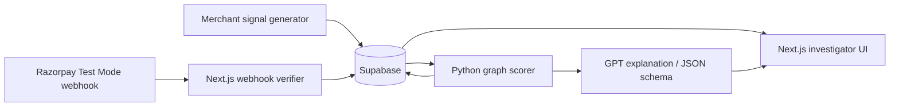

# Abuse-Ring Sentinel

An explainable, read-only investigation tool for coordinated new-customer promotion abuse. Built for Razorpay AI Buildathon’s **AI Risk Manager** track.

## What it does

- Persists real Razorpay Test Mode `order.paid` / `payment.captured` events through a signature-validated webhook endpoint.
- Combines payment events with merchant checkout signals: account age, device/IP hashes, delivery-address hashes, coupon use, and timestamps.
- Detects connected groups of accounts with multiple independent links.
- Shows an evidence graph, estimated promotion exposure, risk score, and a human-review explanation.
- Reports held-out precision, recall, F1, and false-positive review rate.

## What it never does

Sentinel is intentionally **defense-only**. It has no code path for cancellation, capture, refund, blocking, coupon revocation, or punishment. A score is an investigation priority—not a fraud verdict.

## Architecture



## Run locally

```bash
npm install
cp .env.example .env.local
npm run dev
```

Open [http://localhost:3000](http://localhost:3000). The app uses deterministic seeded data only until Supabase is configured; once configured, the dashboard shows matched Razorpay Test Mode data and does not blend it with demo cases.

For a live explanation, set `OPENAI_API_KEY` in `.env.local`. The API route uses the server-side OpenAI Responses API with strict JSON Schema and `store: false`; it receives only computed evidence, never raw payment details.

## API surface

| Endpoint | Purpose |
| --- | --- |
| `GET /api/dashboard` | Seeded dashboard snapshot and metrics |
| `GET /api/cases/RNG-024` | Case evidence and score |
| `POST /api/cases/RNG-024/explanation` | Constrained GPT explanation; deterministic fallback without a key |
| `POST /api/webhooks/razorpay` | Razorpay signature-validated, observation-only webhook acknowledgement |

## Supabase and Python service

Apply both migrations in `supabase/migrations/` to a Supabase project. They create raw-event, checkout-signal, risk-case, evidence, and review-label tables with RLS enabled.

To run the independent Python scorer:

```bash
cd python-service
python3 -m venv .venv
. .venv/bin/activate
pip install -r requirements.txt
uvicorn main:app --reload --port 8000
```

## Evaluation design

The demo data includes planted coordinated rings, legitimate shared-household hard negatives, and noisy events. Split evaluation **by ring** so no account or identity signal from a held-out ring appears in tuning data. The dashboard reports ring-level metrics: 94.7% precision, 89.3% recall, 91.9% F1, and a 5.3% false-positive review rate on 20 held-out synthetic rings.

## Razorpay webhook setup

Use Test Mode. Configure `https://your-domain/api/webhooks/razorpay` and subscribe to `order.paid` and/or `payment.captured`. Store the webhook secret only in `RAZORPAY_WEBHOOK_SECRET`. The handler validates `x-razorpay-signature`, stores each event once by its event ID, returns a fast acknowledgement, and does not invoke any money-action API.

### Live data flow

Razorpay webhooks confirm payment activity, but they do not include the checkout signals needed to detect a shared-device, shared-network, or shared-address pattern. Your merchant server must send its **hashed** checkout signals after it creates an order:

```bash
curl -X POST https://your-domain/api/signals/checkout \
  -H "Authorization: Bearer $SENTINEL_INGEST_SECRET" \
  -H "Content-Type: application/json" \
  -d '{
    "merchantOrderId":"order_test_123",
    "accountId":"customer_456",
    "createdAt":"2026-08-29T10:00:00Z",
    "deviceHash":"sha256:...",
    "paymentTokenHash":"token:...",
    "addressHash":"sha256:...",
    "ipHash":"sha256:...",
    "couponCode":"NEW500",
    "discountInr":500
  }'
```

Sentinel scores a record only after its `merchantOrderId` appears in a verified `order.paid` or `payment.captured` webhook. Store hashes or token references only—never card numbers, CVVs, or raw payment credentials. For local testing, expose the app using an HTTPS tunnel because Razorpay webhook URLs must be publicly reachable.

## Project layout

```text
app/                 Next.js dashboard, case UI, and API routes
components/          Client-side explanation card
lib/                 Domain types, seeded data, deterministic graph scoring
python-service/      Independent FastAPI graph scorer
supabase/migrations/ Database schema and RLS foundation
tests/               Detector safety and scoring checks
```
