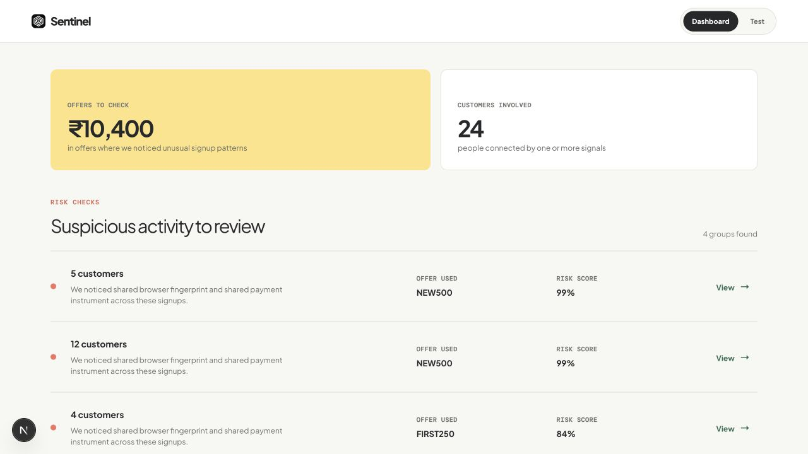
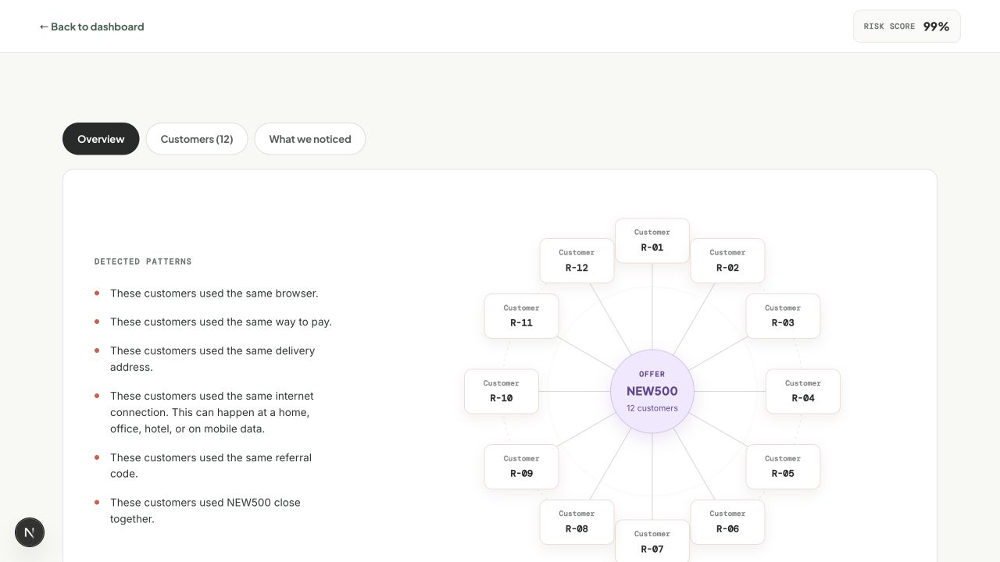
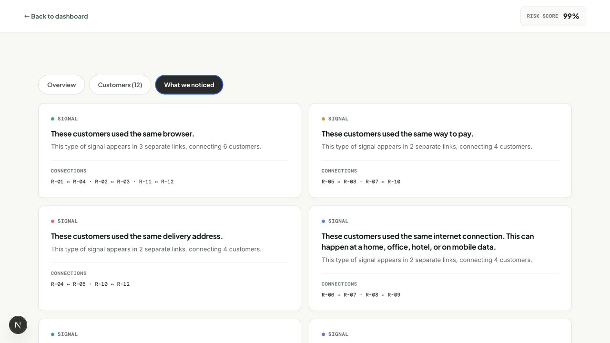
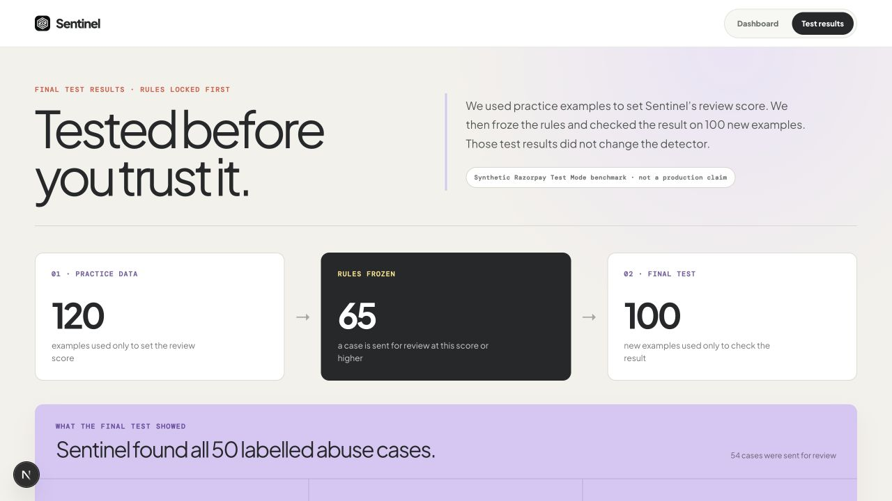
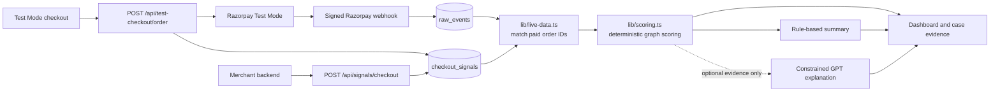

# Sentinel

Sentinel is an explainable promo-offer abuse detector for Razorpay merchants. It connects paid orders across shared browser, payment, identity, address, network, referral, and timing signals so a reviewer can see the whole abuse ring instead of checking one account at a time.

Built for **Track 2 — AI Risk Manager** of the [Razorpay AI Buildathon](https://razorpay.com/buildathon/).

[Live product](https://razorpay-inky-six.vercel.app/) · [Ready-made demo](https://razorpay-inky-six.vercel.app/dashboard?guest=1&demo=1) · [12-account ring](https://razorpay-inky-six.vercel.app/cases/RNG-512?demo=1) · [Held-out test results](https://razorpay-inky-six.vercel.app/test-results)

> Sentinel is strictly defense-only. It never captures, cancels, refunds, blocks, revokes an offer, or punishes a customer. It identifies cases for human review.



## The problem

Welcome offers such as `NEW500` are meant for genuinely new customers. A person or coordinated group can create several accounts and reuse different combinations of the same browser, payment method, contact details, delivery address, network, or referral code.

Simple one-account rules miss this because no single account needs to share every signal. Sentinel builds a connected graph: account A may share a browser with B, B an address with C, and C a payment method with D. The combined pattern reveals the ring.

## What Sentinel does

- Accepts signature-verified Razorpay Test Mode `order.paid` and `payment.captured` webhooks.
- Matches paid orders to privacy-preserving hashed checkout signals using the Razorpay order ID.
- Groups activity by promo offer before connecting accounts, preventing unrelated offers from inflating one case.
- Finds transitive groups of three or more accounts with at least one strong shared signal.
- Calculates an auditable risk score and the total promotion exposure in rupees.
- Shows the exact customers connected by each signal in a visual evidence graph.
- Reports precision, recall, F1, and false-positive review cost on a locked held-out test set.
- Optionally uses GPT to rewrite existing evidence in plain English. GPT cannot add evidence, change the score, or decide the outcome.

## Reviewer quick path

1. Open the [demo dashboard](https://razorpay-inky-six.vercel.app/dashboard?guest=1&demo=1).
2. Select the 12-customer `RNG-512` case.
3. Use **Overview** to show the connected ring.
4. Use **What we noticed** to show the exact pairwise links behind every signal.
5. Open [Test results](https://razorpay-inky-six.vercel.app/test-results) to show the locked threshold, confusion matrix, precision, recall, F1, and false-positive cost.
6. Optionally use the [Test Mode checkout](https://razorpay-inky-six.vercel.app/test-checkout) to make three ₹100 test payments with different customer IDs and shared checkout details.

## Product tour

### A connected 12-account ring

No account contains every signal. Partial browser, payment, address, network, and referral links connect the group.



### Evidence that a reviewer can verify

Sentinel names the customers connected by each signal instead of returning an unexplained fraud label.



### Measured before the demo

The scoring threshold was selected on development scenarios, frozen, and then evaluated on a separate held-out set.



## Deployed architecture

The production request path runs entirely inside the Next.js application. The optional Python service in this repository is a standalone reference scorer; the deployed dashboard does not call it.



### Live data flow

1. `/api/test-checkout/order` creates a ₹100 Razorpay Test Mode order and stores the hashed checkout signals for that order.
2. Razorpay Checkout completes the payment.
3. Razorpay sends a signed `order.paid` or `payment.captured` webhook.
4. `/api/webhooks/razorpay` validates the signature and stores the event once.
5. `lib/live-data.ts` joins checkout signals with verified paid orders by `merchant_order_id`. Failed or incomplete payments are excluded.
6. `lib/scoring.ts` builds same-offer connected components, scores their evidence, and returns review cases to the dashboard.

## Explainable detector

The detector is deterministic and auditable. Every signal has a documented contribution:

| Signal | Contribution | Role |
| --- | ---: | --- |
| Shared payment instrument | 34 | Strong |
| Shared browser fingerprint | 30 | Strong |
| Shared email identity | 28 | Strong |
| Shared phone identity | 28 | Strong |
| Synchronized offer use | 19 | Supporting |
| Shared delivery address | 13 | Supporting |
| Shared referral source | 11 | Supporting |
| Shared network fingerprint | 7 | Weak supporting evidence |

A case requires:

- completed payment evidence;
- the same promo offer;
- at least three connected accounts; and
- at least one strong browser, payment, email, or phone link.

A shared IP address or referral code alone cannot create a case. The locked human-review threshold is **65**.

## Held-out evaluation

```text
120 labelled development scenarios
              ↓
Select the F1-optimal threshold
              ↓
        LOCK AT 65
              ↓
100 separate held-out scenarios
              ↓
Precision · Recall · F1 · false-positive cost
```

| Result | Value |
| --- | ---: |
| True positives | 50 |
| False positives | 4 |
| False negatives | 0 |
| True negatives | 46 |
| Precision | **92.6%** |
| Recall | **100.0%** |
| F1 | **96.2%** |
| Estimated false-positive review cost | **₹600** |

The development and held-out sets use different fixed seeds, account IDs, and signal IDs. The ₹600 cost assumes four unnecessary reviews at ₹150 each.

These are reproducible **synthetic Test Mode results**, not a production-accuracy claim. Real deployment requires merchant-labelled outcomes and a fresh held-out evaluation.

## Exceptions, edge cases, and recovery

| Situation | Sentinel behavior |
| --- | --- |
| Missing or invalid webhook signature | Rejects with `401` before storage |
| Malformed request body | Returns `400` with a clear error |
| Oversized webhook, signal, or checkout body | Returns `413`, including when `Content-Length` is absent |
| Duplicate Razorpay webhook | Returns `200` and does not store the event twice |
| Missing server configuration | Returns `503` instead of pretending the request succeeded |
| Razorpay order timeout or invalid upstream response | Returns `502` and shows a retryable checkout error |
| Database unavailable | Returns `503`; the dashboard shows a retry action |
| Checkout dismissed or payment failed | Shows a clear message and never creates a paid abuse case |
| GPT unavailable, slow, or misconfigured | Returns the deterministic summary after an 8-second bounded attempt |
| Shared household, office, hotel, or mobile IP | Treated as weak evidence and never sufficient on its own |
| Same identity appears across different offers | Kept in separate offer-specific cases |
| Page rendering failure | Handled by route and global error pages with recovery actions |

Automated route and scoring tests cover signature rejection, malformed and oversized bodies, missing configuration, deterministic AI fallback, weak-signal safety, transitive rings, held-out metrics, and cross-offer isolation.

## Privacy and safety

- Email, phone, address, network, and payment identifiers are stored as HMAC-hashed fingerprints or token references. The browser signal is a one-way SHA-256 fingerprint.
- Card numbers and CVVs are never collected or stored.
- Only server routes can read Razorpay secrets, webhook secrets, hashing secrets, and the Supabase service-role key.
- The OpenAI request contains computed case evidence only, uses strict JSON Schema, sets `store: false`, and has a deterministic fallback.
- There is no money-action API in Sentinel.

## API routes

| Route | Purpose |
| --- | --- |
| `GET /api/dashboard` | Live paid-order cases from Supabase |
| `GET /api/dashboard?demo=1` | Seeded visual demo and evaluation metrics |
| `GET /api/cases/RNG-512?demo=1` | Seeded case evidence |
| `POST /api/cases/RNG-512/explanation?demo=1` | Optional constrained GPT explanation with local fallback |
| `POST /api/test-checkout/order` | Creates a Razorpay Test Mode order and stores demo checkout signals |
| `POST /api/signals/checkout` | Authenticated merchant-server signal ingestion |
| `POST /api/webhooks/razorpay` | Signature-validated, idempotent webhook ingestion |

## Run locally

```bash
npm install
cp .env.example .env.local
npm run dev
```

Apply all SQL files in `supabase/migrations/` before using live payment data.

### Environment variables

| Variable | Needed for |
| --- | --- |
| `RAZORPAY_KEY_ID` and `RAZORPAY_KEY_SECRET` | Test Mode order creation |
| `RAZORPAY_WEBHOOK_SECRET` | Webhook signature verification |
| `NEXT_PUBLIC_SUPABASE_URL` | Supabase connection |
| `NEXT_PUBLIC_SUPABASE_ANON_KEY` | Browser authentication client |
| `SUPABASE_SERVICE_ROLE_KEY` | Server-side event and signal storage |
| `SENTINEL_IP_HASH_SECRET` | Network fingerprinting and hashing fallback |
| `SENTINEL_SIGNAL_HASH_SECRET` | Recommended separate identity/address hashing key |
| `SENTINEL_INGEST_SECRET` | External merchant-server signal endpoint only |
| `OPENAI_API_KEY` | Optional GPT explanation; the detector works without it |
| `OPENAI_EXPLANATION_MODEL` | Optional explanation-model override |

Use Test Mode credentials only. Keep secrets in `.env.local` or Vercel environment variables—never commit them.

## Project structure

```text
app/                  Next.js pages and API route handlers
components/           Dashboard, case, landing, and explanation UI
lib/scoring.ts        Deployed deterministic graph detector
lib/evaluation.ts     Development and held-out scenario evaluation
lib/live-data.ts      Paid webhook and checkout-signal matching
supabase/migrations/  Database schema and indexes
tests/                Route, scoring, safety, and evaluation tests
python-service/       Standalone reference scorer; not in deployed path
docs/images/          Clean reviewer screenshots used in this README
```

## Current scope

This Buildathon version uses one configured Razorpay Test Mode workspace. Automated multi-merchant onboarding, per-merchant secret storage, and tenant isolation are intentionally outside the demo scope. A production version would add those controls before onboarding independent businesses.

## Verification

```bash
npm run lint
npm test
npm run build
```

Current automated result: **19 tests passing**, clean lint, and a successful Next.js production build.
